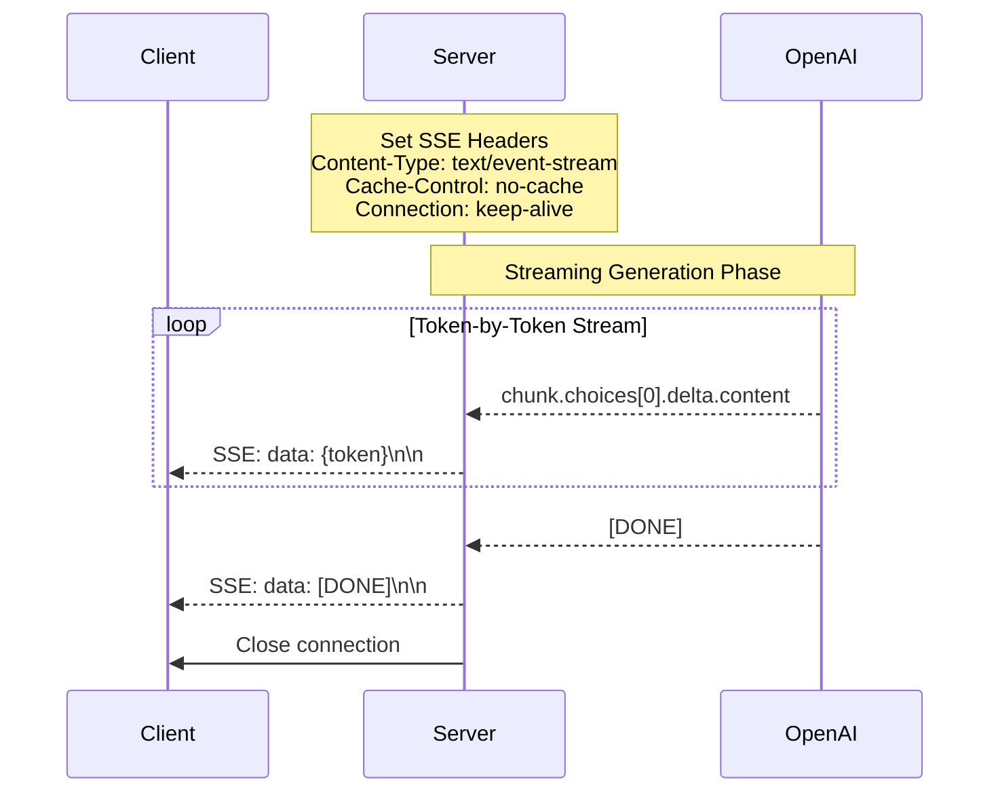
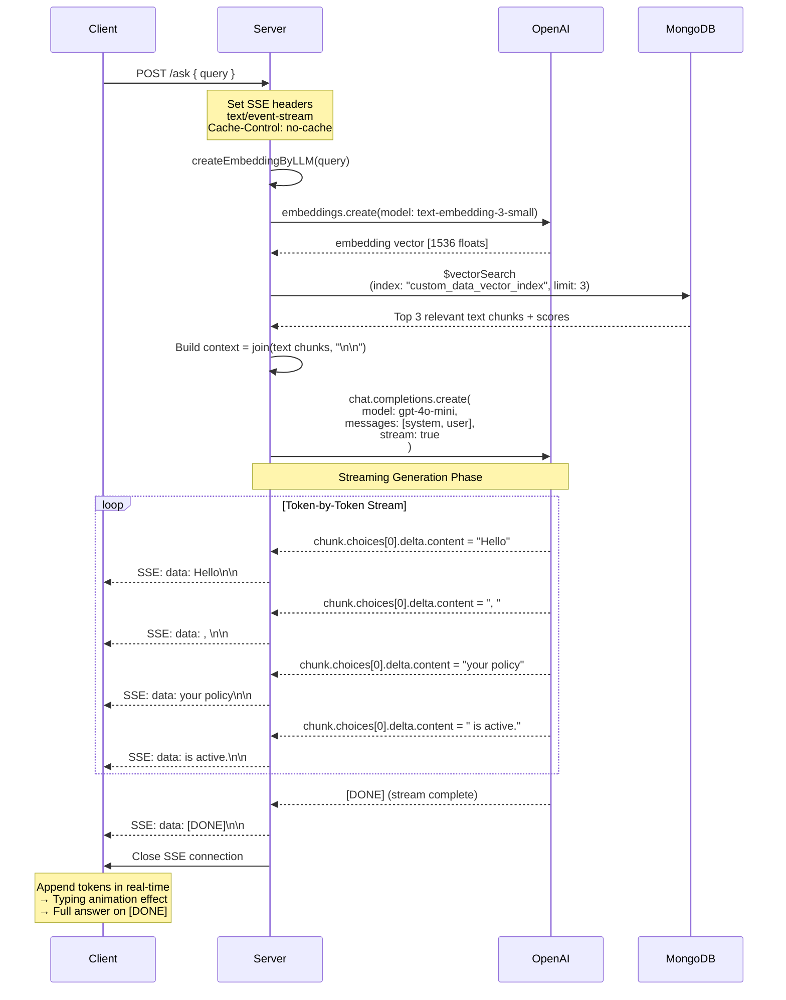
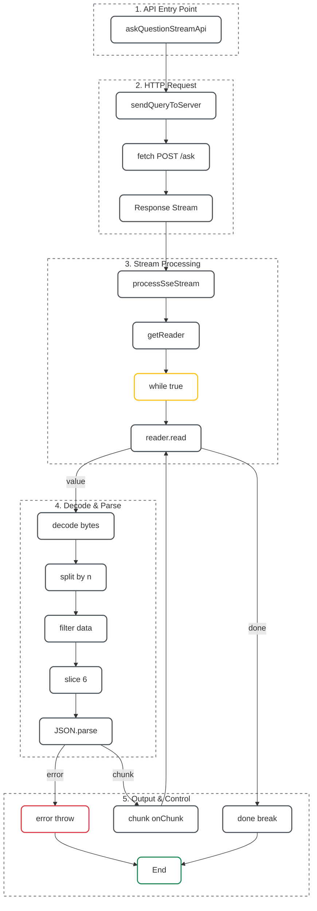
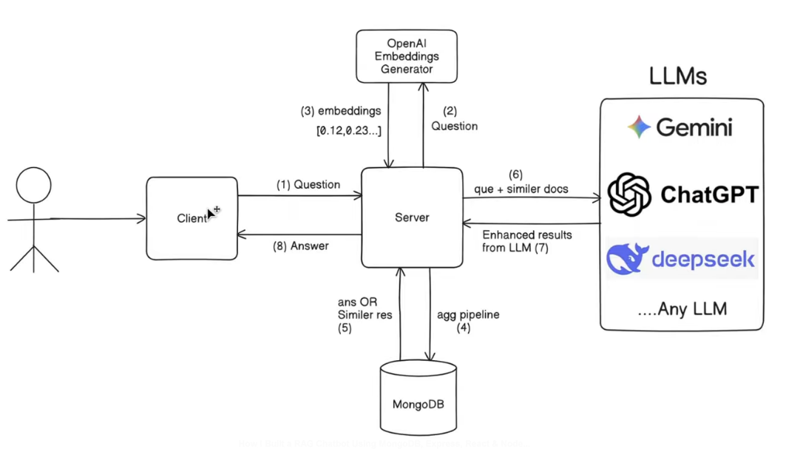

> 22 - October - 2025

# AI ChatBot - RAG

- Retrieval Augmented Generation

## For Package Install:-

```sh
bun i
```

## For Client & Server:-

```sh
bun dev
```

## 📡 What is SSE?

- SSE (Server-Sent Events) is a standard HTTP-based protocol for ➡️ unidirectional, real-time communication from server `→` client.
- The client opens a persistent connection, and the server pushes data as text-based events over time.

## 📡 Why Use SSE?

- ✅ Real-time UX: Users see responses as they’re generated (like ChatGPT).
- ✅ Simple: Built on HTTP, no WebSockets needed.
- ✅ Efficient: Low overhead, automatic reconnection support.

## 🧠 Flow

- Building a Full Streaming Pipeline with SSE (Frontend + Backend)
- This transcript describes how to implement end-to-end streaming between:
  - Frontend (React) ↔
  - Backend (Node.js/Express) ↔
  - LLM API (e.g., OpenAI)

## 🔎 Core Concept: Two Streaming Layers

1. Backend → LLM API:
    - Your server opens a streaming connection to the LLM (stream: true).
    - Receives tokens as chunks (not full response).
2. Backend → Frontend:
    - Your server forwards each token immediately using Server-Sent Events (SSE).
    - Frontend consumes this stream in real time.

## 🔄 Data Flow

```sh
User → Frontend → Backend → LLM → Backend → Frontend → UI (live)
```

```sh
Streaming isn’t just about - stream: true 
it’s about chaining streams from 
LLM → your server → frontend...

while handling parsing, errors, and UI updates correctly at each hop.
```

## 🤖 How Streaming Works with LLMs (e.g., OpenAI)

- When `stream: true` is set in the LLM API call:
- The response is ***not a single JSON object***, but a ***stream of chunks***.
- Each chunk contains a partial token (e.g., "Hel", "lo", "!").
- The stream ends with a final signal (e.g., data: [DONE]).
- Parse incoming lines:
  - Split by \n\n
  - Extract JSON after data:
  - Append chunk to UI in real time
  - Stop when { done: true } is received

## ⚛️ Frontend (React)

- Use fetch() + response.body.getReader() to read the stream.

## ⚠️ Important Notes

- SSE is server → client only (perfect for LLM streaming).
- Always handle parsing carefully — chunks may split mid-line.
- Client ↔ Server: Server-Sent Events (SSE)
- Server ↔ OpenAI: OpenAI streaming API
- stream: true + SSE = Real-time, token-by-token LLM responses

## 🖥️ Server Side

- SSE Headers: Set proper headers for Server-Sent Events
- OpenAI Streaming: Enable stream: true in OpenAI API call
- Chunk Processing: Forward each OpenAI chunk to the client via SSE format

## 💻 Client Side

- Fetch API: Use native fetch with response.body.getReader() instead of axios
- Stream Reading: Decode chunks and parse SSE format
- Real-time Display: Show currentStreamingMessage as it arrives

## ➡️ Key Technologies for streaming

- **Client → Server**: `fetch()` + ReadableStream - HTTP request initiates SSE
- **Server → Client**: Server-Sent Events (SSE) (text/event-stream)
- **Server → OpenAI**: OpenAI streaming API (`stream: true`)
- **Format**: `data: {"chunk":"text"}\n\n`

#

## ⚙️ Only Stream Data Flow:-



#

## ⚙️ RAG + Streaming Data Flow:-



## 🪜 Work Groups Summary

|NO| Group      | Responsibility        | Key Functions             |
|--|------------|-----------------------|---------------------------|
|1.| Entry      | Start streaming,      | askQuestionStreamApi()    |
|2.| Network    | Send request,         | fetch()                   |
|3.| Stream     | Read raw bytes,       | "getReader(), while loop" |
|4.| Parse      | Bytes → Text → JSON,  | "decode, split, parse"    |
|5.| Output     | Deliver or end,       | "onChunk, break, throw"   |

## 🪜 Streaming API – Step-by-Step Work Groups



## 🔄 Full Flow Summary

```sh
[Frontend Orchestration]
   ↓
[Network Request] → (HTTP POST to /ask)
   ↓
[Stream Consumption] → (Read → Decode → Parse → Callback)
   ↓
[UI Integration] → (Live update in React)
```

## 💢 Workflow of RAG:-


